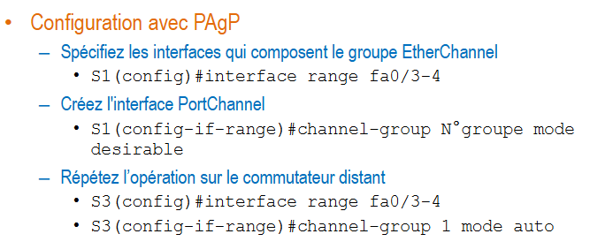
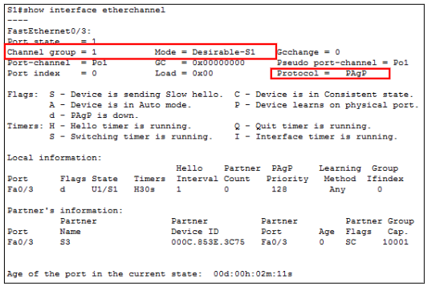
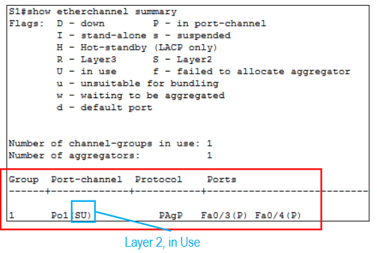

# Exercices : chapitre 6

Objectif Exercice : 
- Trouver : 
    - root bridge (RB)
    - root port (RP)
    - determinated port (DP)
    - bloqued port (B)

Comment procéder : 

- déterminer le root bridge -> plus basse priorité / si même -> regarder MAC + basse 
- déterminer les root port -> port vers le root bridge /si indirect -> regarder priorité/ si même priorité -> regarder plus petit port 
- Déterminer les DP (designated port) -> port de chaque segment le plus proche du routeur / si même cout de chaque coté -> regarder la plus basse priorité 
- déterminer les port bloqués -> ce qu'il reste 

# Chapitre 7 : Agrégation de liaison 

## Agrégation de lien 

Problème : besoin de + de bande passante car beaucoup de traffic (goulot d'étranglement)

Solution : Mettre plusieurs cables qui vont entre deux periphériques 

Problème : Deux lien entre deux switch -> STP détecte ça comme une boucle -> il le bloque 

Solution : LAG ("EtherChannel" chez Cisco) -> dire que deux lien physiques sont un seul lien logique

Ou mettre des agrégation de lien ? : ou il y a le plus de trafic / car sans plusieurs cables -> goulot d'étranglement  

> avantages : ... 

> en pratique : 3 ports (Fa0/3 , Fa 0/5) -> un port-channel 1

## Caractéristiques EtherChannel 

- impossible de créer un etherchannel qui va vers deux périphériques différents / SAUF si switch empilable car un switch logique 

- ... 

## Automatique EtherChannel 

### PAgP

PAgP (Cisco) : Permet la **création** et **gestion** AUTOMATIQUE de l'EtherChannel 

fonctionnement : envoie des paquets toutes les 30 secondes pour verifier la cohérence, les ajouts, défaillances

#### Modes PAgP

- On : force etherchannel 
- Desirable : Negociation active (initie la négo.)
- Auto : Négociation passive (attend une invitation à la négo)

### LACP 

même que PAgP mais non propriétaire Cisco 

## Conditions pour former EtherChannel 

- Ne pas faire d'EtherChannel entre plusieurs couches (L2 x L3) (L2 = L2) (L3 = L3)

- Configuration dans VLAN identiques 

- Même vitesse des deux ports (Fa x Gb)

- Même mode bidirectionnel des deux ports (half/full - duplex)

## Commandes 

## Verif Config 

## Exemple Cisco Packet Tracert 

1 Ajout d'un switch dans un réseau avec switch vlan configurés  

2 Via VTP le switch est pris comme meilleur (grâce au numéro de révision) donc tous les autres switch se sont synchroniser à lui.
Donc le réseau tombe en miette 

3 DTP fais un trunk entre 2 switch sans protection donc peut accéder à toutes les vlan DANGEREUX 

# Chapitre 9 : Introduction à la cybersécurité 

> Définition CyberSécu (selon l'ITU) : Ensemble des outils, politiques,... qui peuvent être utilisé pour protéger les cyberenvironnements et les actifs (actif : ce qui a de la valeur)

## Terminologie 

- Actif :
    - Choses personnes utile ou précieuse qui doit etre protégée 
    - Classer les actifs 
        - Pour savoir quoi sécuriser en premier et gérer le budget
- Menace 
- Vulnérabilité 
- Vecteur d'attaque 
- Surface d'attaque 
- Risque 
- Impact 
- Evaluation du risque 
- Matrice de risques 

## Objectifs de la cybersécurité 

[CIA]

Confidentialité / Integrité / Disponibilité 

 \+ Une action ne peut pas être niée 
 \+ Conserver les traces des activités 

1. protection des SI (objectifs)

2. Proctection des informations dans chacun de ses états possibles 

3. Protection des système et données

