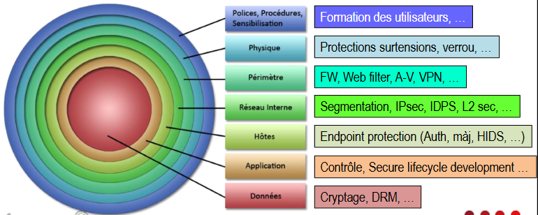

# Chapitre 9 

## Malware 

> Un malware est un logiciel malicieux  

## Exemples

- ADware 
- Spyware (logiciel espion)
- Virus
- Trojan 
- Worm ( Ver sans intervention se transmet)
- Ransomware 
- Scareware (Alarmer tout le monde pour les faire installer un virus)
- Rootkit 
- Bot, Botnet (réseau de robot)
- Malware fileless (Virus injecté dans la RAM)
- Malvertising : pirate demande à une regie publicitaire de rediriger leur pub vers un site malveillant 
- Drive-by Download : Site légitime qui a été piraté donc dangereux de s'y aventurer 
- application malveillant 
- Juice Jacking : cables infectés 
- social Engineering : discuter et se faire passer pour un "helpeur" pour divulguer des informations 


Site pour s'entrainer à repérer des attaques : [Lien](https://safeonweb.be/fr/testez-votre-securite)

## Exemples de techniques et outils pour reconnaissances 

- Recherche/demande d'information 
- Ping Sweep 
- Port scan 
- SCanner les vulnérabilité 

## Trouver Mot de passe 
 - keylogger
 - attaque dictionnaire 


## Autres Techniques 

- buffer overflow : saturer la mémoire tampon pour déborder et des information de redirection peuvent être écrasée et changée pour executer un code malveillant 

- Man-in-the-middle attack : mec entre la victime et le serveur pour choper des données (ou il se met en faux point d'accès)

- injection SQL

- DoS
    - paquets mal formé : incapable de traiter un paquet 
    - l'épuisement de ressource 

- Ping of Death (Obsolète)

- Mail bombing : saturer boite mail 

- Clé USB : faux clavier qui tape des trucs 

- Talonnage : rentrer sans badge 

- Fouille de poubelles 

- clonage de badge 


## Les attaquants 

### Les hackers 

- Black Hat : illégale 

- White Hat : légal sous autorisation 

- Grey Hat : Cherchent des vulnérabilités dans un système, mais ne les signaleront aux
propriétaires que si cela coïncide avec leur objectif.


- Script kiddies 

- Cyber criminels : Black hats travaillant seuls ou pour une organisation criminelle dans le but de
s’enrichir

- Hacktivistes 

- Hacker financés par un état 

- les exemployés mécontents 

## Sources vulnérable 

- protocoles : ipv4 a 0 sécurité 

- Technologie 

- Les codes (programmation)

- les lieux 

- Erreur procédurale 

```
SECURITY IS NOT AN OPTION 

--> SECURITY BY DESIGN

--> SECURITY BY DEFAULT 

```


## Défense multicouche 

Alias sécurité en oignon 

Beaucoup de couches de sécurités à respecter pour éviter que la sécurité ne
dépende que d’un seul composant.




tout ca en restant "User friendly" 