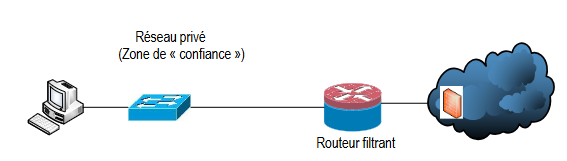
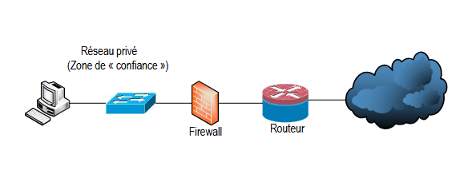
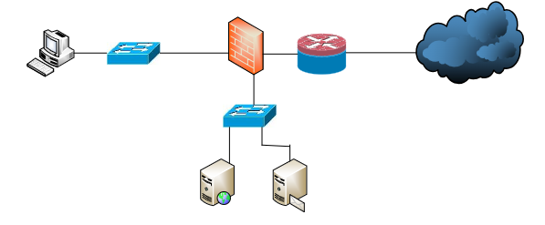
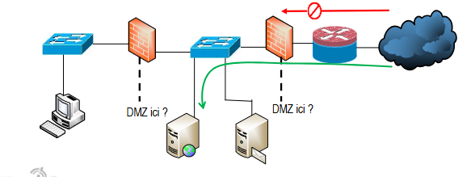
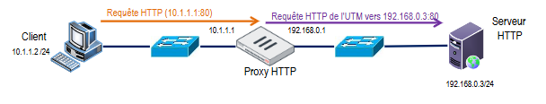
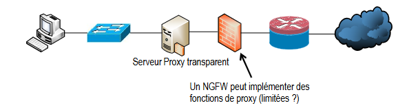
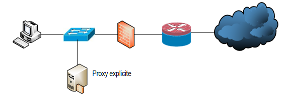
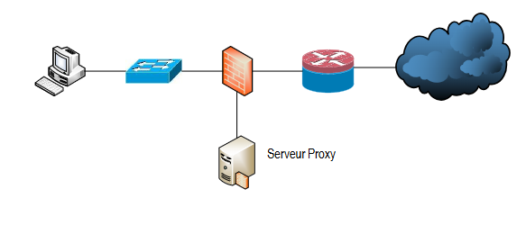
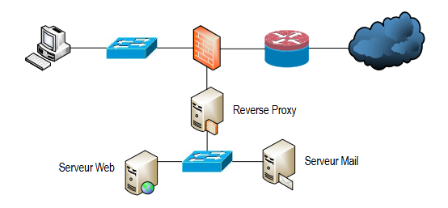
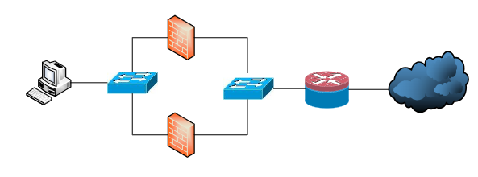

# Chapitre 9 : Suite dernier cours 

## La sécurité est un processus continu 

-> sécurisation -> surveillance -> test -> amélioration -> sécurisation -> ... 

### Vilibilité 

Logs : 
interessant de faire des logs de ce qui sort de notre pc 

## Ressources interessantes 

- CERT (Computer Emergency response team)

- NIST Framework : donne des conseils pour sécuriser ses infrastructures 

- cyberfundamentals framework : de small le moins sécurisé à experimental le plus sécurisé (ce qu'on utilise en cybersec est le IMPORTANT)

- OWASP 

- MITRE : site quoi montre toutes les CVE ( common vulnérabilité )

Site pour les vulnérabilités :  [CVE](https://www.cvedetails.com/)

- Cyber kill chain : décrit les étapes utilisées par un cyber attaquant 
    - reconnaissance : obtiennent renseignement 
    - Armement : avec quoi je peux attaquer ce que j'ai reconnu 
    - Livraison : envoyer son arme sur la cible 
    - exploitation : le malware s'éxecute 
    - installation : l'attaquant peut installer un accès persistant sur la cible 
    - commandes et contrôle : prise de contrôle à distance d'un système 
    - action sur les objetifs : voler, détruire, chiffrer... 

- ENISA : document listant 12 profils types de professionnels de cybersec 

- NIS2 : c'est une norme européenne pour les entreprises critiques
    - entreprises concernées : Énergie, transport, finance, santé, administration publique. 

    - amande si on ne respecte pas 

## Sécurité périmétrique 

à l'époque trust dans le réseau et zero trust dans l'internet 

maintenant zéro trust partout même dans son propre réseau 

à l'époque pare feu se limite au filtrage d'ip et de port 

maintenant il va plus haut dans la couche OSI il peut filtrer des services 

Routeur ISR intergreted service routeur : FAI gère un firewall pour nous 

DMZ : Zone démilitarisée : zone sécurisée en dehors du réseau ? 

## Architectures 

### Architecture simple avec routeur filtrant

Principe : Un routeur avec des ACL assure la sécurité.

---

### Architecture simple avec pare-feu

Routeur + Parefeu 

---

### Architecture avec DMZ 

DMZ : Zone Sécurisée séparée du réseau qui est accécible depuis l'internet 

---

### Architecture avec pare-feu dos à dos + DMZ

DMZ + Parfeu de chaque cotés de la zone DMZ 

---

### Architecture avec proxy (général)

Le proxy fait en sorte que le client ne communique pas directement avec le serveur 

---

### Proxy transparent (Cas n°1) 

Le client ne sait pas qu'il passe par un proxy 

---

### Proxy explicite (Cas n°2 / 3)

---

### Reverse proxy

---

### Architecture redondante 

---

> A COMMPRENDRE EN PROFONDEUR ET COMPLETER LES ARCHITECTURES 

