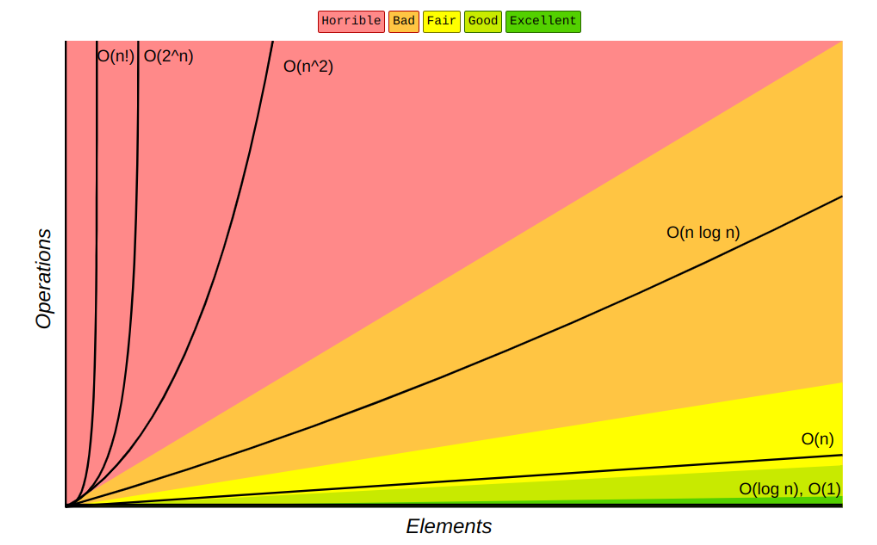

# Mathématique orienté informatique 

## Info pratique 

30% travail continue (exercice en classe)

70% examen écrit oral (comme tech. num.)

## Intro 

Exactitude /= Optimal 

On cherche l'exactitude

## Efficacité 

le temps de calcul -> La complexité temporelle 
L'espace utilisé -> la complexité spaciale

## Complexité 

au dessus de O(n²) -> rouge 

O(n!) le pire 

Complexité -> temps de calcul plus complexe + calcul -> nul 

## Analyse asympthote 

Analyse des limites liées aux grandes quantités de données 

## Opération primitive 

Sert a calculer la complexité 

c'est une instruction en language de haut niveau (Assembleur)

chaque instruction (genre un if)

mais il ne faut pas compter chaque lignes 

## Compter les opération primitives 

a = b * 3 -> 2 opération -> 1 multiplication + 1 affectation 

## Complexité temporelle 

Big O -> O(f(n))

O(3n² + 5n + 7) -> 5n + 7 négligeable 

-> O(n²)

