# Structure discrète 1 : 

## Les ensembles 

> Elements qui ne sont pas listé par importance et qu'il n'y a pas de doublons 

notation en 

- extension : On liste tous les éléments de l’ensemble entre accolades.
- compréhension : On décrit la propriété que doivent respecter les éléments de l’ensemble.
- symboles spéciaux : N, Z, Q, R (Naturel Entier, réel)

### inclusion 

A ⊆ B 

A est inclu dans B 

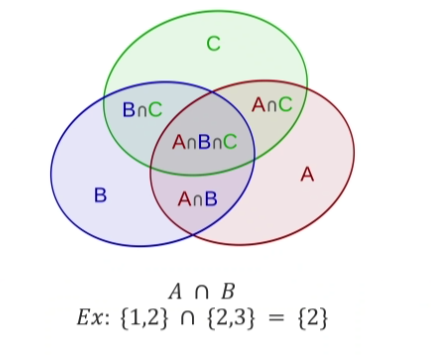

### Union 

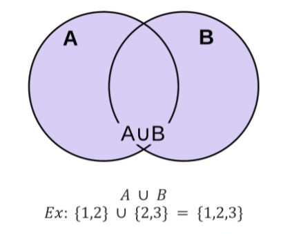

> ca existe en python 

### différence 

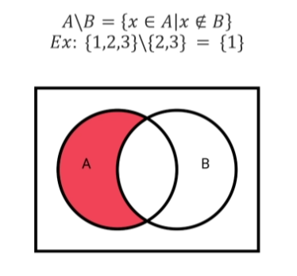

### complémentaire 

L'univers de A 

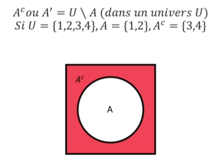

## Calcul d'ensembles 

### Produit Cartésiens

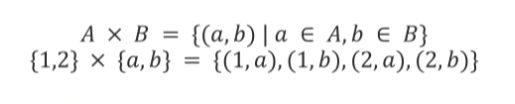

Non-commutatif et non associatif => A x B pas égal à B x A 

### Ensembles finis et infinis 

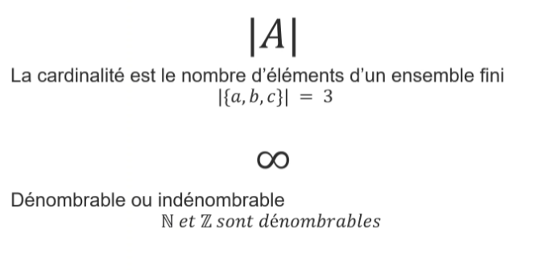

Pour les Entiers c'est infini mais on sait les comptés mais c'est long

pour les Réels entre chaque réel il y a une infinité de nombres a virgule 

> Question d'examen 

## Relations binaires 

### Notions de base 

Exemple : 

relations sur instagrame 

### Reflexive 

chaque élément est en relation avec lui même 

### Symétrique 

si x est lié a y alors y est lié a x 

x ne peut pas etre ami avec y si y ne le connait pas 

### Antisymétrique 

si a < ou égal à b et b < ou égal à a alors a = b 

si relation entre a et b fonctionne dans les deux sens alors a=b 

### Transitive 

A>B et B>C alors A>C 

### Equivalence (Réflexive + Symétrique + Antisyémtrique)

Avoir le même age -> relation equivalante 

a et b on le meme age -> symétrique 

### Relation d'ordre partiel 

Relation qui est Reflexive 
Antisymétrique 
Transitivé 

## Exercices 

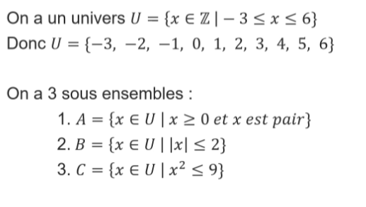

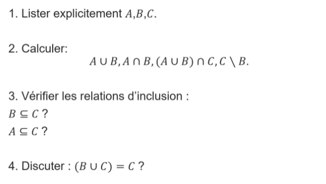

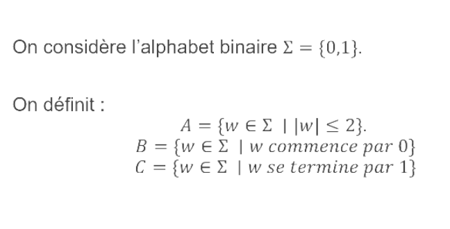

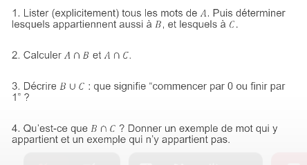

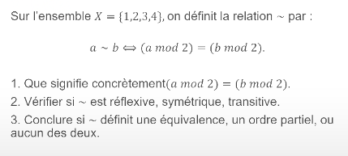

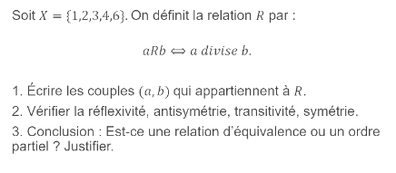

A 2 4 6 

B = 2, 1, 0, 1, 2

C = -3, -2, -1, 0, 1, 2, 3

--- 

A 0, 1, 00, 01, 10, 11 .

B toutes les combinaisons de 0 et de 1 mais commence par 0 

donc c'est un ensemble infini 

B toutes les combinaisons de 0 et de 1 mais commence par 1 

donc c'est un ensemble infini 

