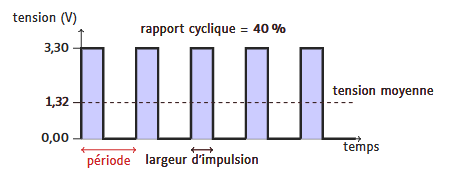

# PMW et Moteur

## Intro 
- Objectif : controler une charge
    - Controler la vitesse d'un moteur 
    - ajuster la luminosité d'une led 
    - créer des couleurs intermédiaire avec une led

    => moduler la puissance 

- problème : sortie digitale -> 0 ou 1 / 0 ou 3,3V 
- solution : PWM 

## PWM

- PWM Pulse Width Modulation 
- pourcentage du moment sur la période que le signal est à 1  
- = Puissance moyenne 

ici, 40% car largeur de tension à 1 / 40% de la période 

## Moteur DC

Principe : Demande un courant élevé au démarrage

Vitesse a la quelle tourne le moteur est proportionelle à l'énergie qu'on lui donne 

peut tourner dans les deux sens 

GPIO : servent a alimenter 

vitesse du moteur : se commande grâce au PWM 

Pont en H pour contrôler la direction 
( inverse, direct, frein, roue libre )

## Servomoteur 

PWM : donne l'angle du servo moteur 
grâce a gpiozero commande : servo.angle = 45.0 (45°)

## Conclusion 

- PWM pour moduler la puissance transmise 
- Led controlée par PWM 
- Pont en H pour contrôler la direction 

## Conseil projet 

Ne pas faire premier démarrage de voiture à 100% 

20% de la puissance maximale du moteur pour bien démarrer 

